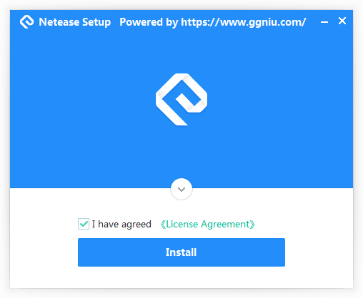
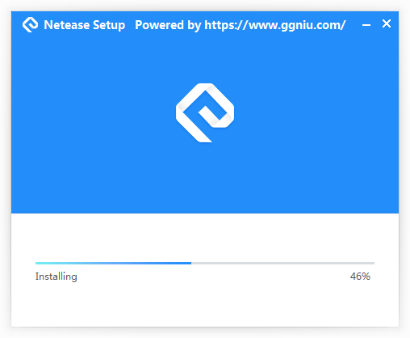
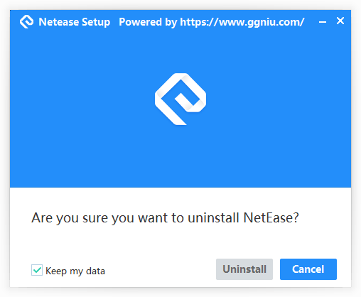
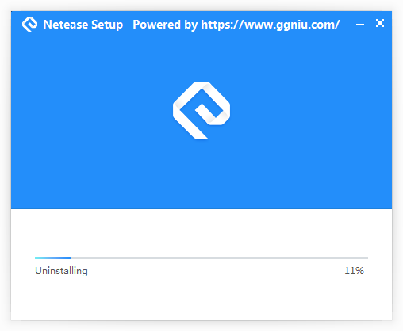

# Introduction
This product is a modern and beatiful UI plugin based on DirectUI for NSIS. It is compact in size and powerful in functionality. We provide a comprehensive product packaging and release solution that includes UI configuration, installation script, and one-click packaging.

# preview the install windows







# Steps to modify the UI, package files, and modify scripts based on the template
## 1.	Customize the product info
Modify the xxx_setup.nsi file under the corresponding project directory in the SetupScripts directory: 
```
# ====================== Product info ==============================
!define PRODUCT_NAME           		" Leeqia_Capture "
!define PRODUCT_PATHNAME 			"Leeqia_Capture"  #registry key
!define INSTALL_APPEND_PATH         "Leeqia_Capture"	  #append directory name 
!define INSTALL_DEFALT_SETUPPATH    ""       #default setup path  
!define EXE_NAME               		"牛牛截图.exe"
!define PRODUCT_VERSION        		"2.5.0.0"
!define PRODUCT_PUBLISHER      		"Leeqia"
!define PRODUCT_LEGAL          		"Leeqia Copyright（c）2020"
!define INSTALL_OUTPUT_NAME    		"Senior_PC_Setup_v2.5.0.exe"

# ====================== Customize info==============================
!define INSTALL_7Z_PATH 	   		"..\app.7z"
!define INSTALL_7Z_NAME 	   		"app.7z"
!define INSTALL_RES_PATH       		"skin.zip"
!define INSTALL_LICENCE_FILENAME    "licence.rtf"
!define INSTALL_ICO 				"logo.ico"
!define UNINSTALL_ICO				"uninst.ico"
```
## 2.	Copy the files which need to be packaged
Place the information of the files to be installed in the 'FilesToInstall' directory; the packaging script will compress and package this directory (including multiple levels of subdirectories).

## 3.	Configure the UI in the 'skin' directory

- install.xml: This is a master script.

- configpage.xml: Configures the first UI displayed after opening the installation package, also used for selecting installation paths and other options.

- licensepage.xml: Configures the UI for displaying the license agreement.

- installingpage.xml: UI during the installation process.

- finishpage.xml: UI displayed upon completion of the installation.

- uninstallpage.xml: Uninstallation entry UI.

- uninstallingpage.xml: UI during the uninstallation process.

- uninstallfinishpage.xml: UI displayed upon completion of the uninstallation.

- msgBox.xml: Secondary popup window.

The "images" subdirectory is used to store the image information required for the UIs.
## 4.	Modify the scripts
If there are specific installation features that require modification, please go to the corresponding project directory under SetupScripts and modify the file xxx_setup.nsh.

- Function DUIPage: Installation entry script used to initialize some information.
- un.DUIPage: Uninstallation entry script.
- BindUIControls: Binds buttons and other responsive events.
- ShowMsgBox: Displays secondary sub-windows.
- OnBtnInstall: Controls the main installation process.

## 5.	Start package
- Simply execute xxxx-nozip.bat in the directory to complete the packaging.
- The packaged files will be placed in the Output directory.
- Note: Do not place the packaging script directory in a directory with Chinese characters.

## 6.	Other Notes/Points to Consider 
- The currently configured NSIS is the Unicode version, so Chinese characters displayed in the console may appear as question marks. You can ignore it.
```
@rem If you want to debug errors, please use the following script, which will open the compilation UI (Chinese characters will appear as question marks in the command-line UI).
".\NSIS\makensisw.exe" xxx
```
- The NSI file contains information related to the installation configuration. The actual installation logic is in commonfunc.nsh and the NSH file that accompanies the NSI file.

- If you have UIs that you don't understand, please refer to the examples and documentation.

- All NSI and NSH files for NSIS need to be in Unicode or UTF-8 encoding.

- For the ShowMsgBox UI, an additional parameter has been added to specify the style file used for the popup window. For example:
```
nsNiuniuSkin::ShowMsgBox "notice title" "notice message." 0 "msgBox2.xml"
```
This will use the style described in msgBox2.xml to display the window, facilitating personalized customization of the popup message box.

- To use an RTF file as the license agreement file, simply change the agreement file to RTF (refer to the Nim example).

## 7.	New Version
Our latest version has incorporated the following features, significantly reducing the time spent in the installation package creation process while ensuring the delivery of higher-quality installation packages:

- Multi-language Support
- High-DPI Support
- Silent Installation
- Upgrade Installation
- Online Installation
- Installation Behavior Reporting
- Anti-Decompile, Protection of Installation Package UI Resources and Scripts
- Automatic Signing of Installation Package and Uninstaller to Prevent False Positives
- Various Exquisite Templates for Quick Application
- Visual Configuration Wizard, No More Worries About Configuration Issues
- More templates


More information, please visit:
https://www.ggniu.com/nsniuniuskin/productdes/
